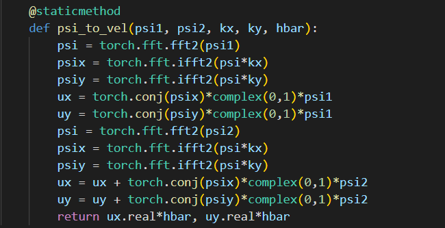

$$
\psi_{n} \longrightarrow \boxed{\text{NN}} \longrightarrow \text{Normalize} \longrightarrow \text{Project} \longrightarrow \psi_{n+1}
$$

用这个函数把$\psi$转化成速度$u$，损失函数可以用下面的式子表示：
$$
\begin{align*}
\frac{u_{n+1}-u_{n}}{\Delta t} &= \nu \nabla^2u_{n}-(u_{n}\cdot\nabla)u_{n} \\
&= \nu\widetilde{\left[-(\omega_x^2+\omega_y^2)\begin{pmatrix}
\hat{u}_x \\
\hat{u}_y
\end{pmatrix}\right]}- \begin{pmatrix}
u_x\cdot\widetilde{\text{i}\omega_x\hat{u}_x} + u_y\cdot\widetilde{\text{i}\omega_y\hat{u}_x} \\
u_x\cdot\widetilde{\text{i}\omega_x\hat{u}_y} + u_y\cdot\widetilde{\text{i}\omega_y\hat{u}_y}
\end{pmatrix} \\
&= \nu\widetilde{\left[(k_x^2+k_y^2)\begin{pmatrix}
\hat{u}_x \\
\hat{u}_y
\end{pmatrix}\right]}- \begin{pmatrix}
u_x\cdot\widetilde{k_x\hat{u}_x} + u_y\cdot\widetilde{k_y\hat{u}_x} \\
u_x\cdot\widetilde{k_x\hat{u}_y} + u_y\cdot\widetilde{k_y\hat{u}_y}
\end{pmatrix}
\end{align*}
$$
